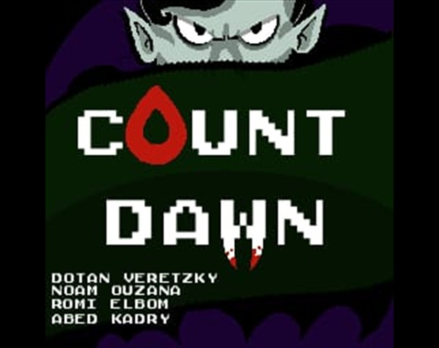

# Count Dawn 🧛🌅

**GMTK Game Jam submission — theme: "Countdown".** A reverse horde survival game: you are the monster. Hunt the humans who came to kill you, drink enough of them to matter, put down whatever they sent to lead the mob, and be back in your coffin before the sun finishes rising.

[Play Count Dawn](https://count-dawn.vercel.app) | [Itch.io](https://dotanv.itch.io/count-dawn) | [Source](https://github.com/DotanVG/Count-Dawn)

Count Dawn runs in the browser with no account or install, on desktop and on mobile. The countdown to dawn is always ticking and always on screen.

## The Night

The castle great hall **is** the main menu. Press START and the coffin opens; the Count spirals out of it as a bat and lands in the middle of the floor.

Each night runs on one clock:

1. Hunters walk in from the arena edges and come straight at you.
2. Kill them. Every corpse scatters bloodlets that fly to your Blood Meter.
3. Filling the meter summons that night's **boss lineup** at the far edge of the hall.
4. When the meter is full **and** every boss is dead, the coffin lights up.
5. Get inside before the timer hits zero.

Surviving does not end the run. The lid shuts, your blood drains into your health bar, the sun crosses the sky and sets, a new moon rises, and the Count flies back out for a harder night. **Dawn or death are the only ways a run actually ends** — and both show a full debrief of everything you did across every night.

## What Hunts You

| | |
| --- | --- |
| **Pilgrims and huntresses** | The basic hunters, and every one of them arrives armed. Which of the two faces walks in is cosmetic; the weapon is what changes the fight. |
| **Wooden spike** | Fast, close jabs. |
| **Pitchfork** | Stabs from outside arm's reach — the reason to keep moving. |
| **Burning torch** | Chops in an arc, trailing embers the whole time it is carried. |
| **Garlic farmers** | Never close. They paint a green crosshair that crawls from their feet onto you, lock, and lob a bulb at the spot. From night two on, one fewer than the night number. |
| **Pilgrim Captain** | Bigger, tougher, hits twice as hard, shrugs off knockback — swinging the same weapon his men carry. |
| **Garlic Captain** | A Captain with a bulb in each hand. |
| **Huntress Captain** | The only hunter with the gold crosses, and she throws them like shuriken: a fan of three that flies flat and keeps going. Dodged sideways, not backwards. |
| **The Priest** | Every fifth night, in place of the Captains. Carries a wooden stake, and every few seconds plants his feet and drives out a ward of holy light. |

A weapon buys **reach and cadence, never damage** — every regular hit costs 5 HP whatever swung it. Captains and the Priest hit for 10.

### Boss telegraphs

Bosses cannot be staggered out of a special. Hitting one mid-attack shoves it and nothing more, so every boss warns you first: a ring closes and brightens on its body — **gold** for the Priest's ward, **red** for a Captain's swing, **green** for a garlic volley. The answer is footwork, not damage.

The Priest's ward is the clearest case. The full circle is painted gold on the floor for most of a second before anything burns, then the light sweeps out as staggered rings while a giant golden cross rises out of the circle trailing sparks. Walk out while it is being drawn, or dash through the edge in bat form — the dash's invulnerability carries you clean.

## Controls

| Action | Desktop | Mobile |
| --- | --- | --- |
| Move | WASD / Arrow keys | Virtual joystick |
| Aim + Attack | Mouse + Left click | Tap toward the target |
| Strike nearest | Space (hold) | ⚔ button (hold) |
| Bat dash | Shift | 🦇 button |
| Pause | Esc / P | ⏸ button |
| Restart | R (on end screens) | Tap the button |

The Count faces the cursor — he is aiming, not steering, so you can back away from a crowd while still facing it.

The **bat dash** is a short invulnerable burst with after-images and a HUD charge strip. It is how you break out of a crowd, how you dodge a garlic lock, and how you cross a Priest's ward.

Mobile requires landscape; a rotate prompt appears in portrait.

## Player-Facing Features

- Wordless **cold open** that teaches the loop: the Count comes home nearly dead, takes the squad that followed him in, drinks his fill, and sleeps off a day.
- **Lightning title gag** on the menu — the cover rests on COUNT DAWN, a storm flash stutters it onto COUNT DOWN, and another knocks it back.
- **Seamless night cycle** with no screen in between: coffin, blood-to-health transfer, sunrise, a full day, and the next night's moon rising over the hall.
- Living sky behind the windows — night gradient, twinkling stars, a sun that rises into the middle window and fully sets into the right one, and a moon that carries a real lunar phase per night.
- Sunrise countdown framed in the centre window, with tick pops, a growing tremble, and a red panic mode with vignette and camera shake in the final ten seconds.
- **Bat form** for the dash and both coffin flights, with a *poof* of smoke on every transformation.
- Mouse-aimed melee arc with a cooldown pip, hit flash, knockback and a magic burst on every landed strike.
- Blood overflow past the night's quota heals the Count instead of being thrown away.
- **End-of-run debrief** on any death: nights survived, total blood drained across the whole run, and full breakdowns of hunters drained and mini-bosses slain — each line with the thing it counts animated beside it.
- Pause overlay, fullscreen button, rotate-to-landscape gate, and device-aware menus and hint text.
- **In-game audio balance editor** (see below) for tuning every track and effect live.

## Audio Balance Editor

Append `?audioEditor=1` to the URL and press **F8**. A panel lists every music track and sound effect with a live volume slider, a master mute, and a button that dumps the current values as a code block ready to paste into `src/data/audioBalance.ts`. The OS mouse pointer is restored while the panel is open so the sliders can be dragged.

Full details in [docs/AUDIO.md](docs/AUDIO.md).

## Tech Stack

- **Phaser 4** — rendering, Arcade physics, animation, tweens, audio.
- **TypeScript** (strict) and **Vite** for the build.
- **ESLint** and `node:test` for the pure game-rule tests.
- **Python + Pillow** for the offline sprite-sheet pipeline (`tools/`), not part of the runtime.
- Fully static output — no backend, no accounts, no network calls.

## Local Development

```bash
npm install
npm run dev
```

Open the printed localhost URL.

| Command | Purpose |
| --- | --- |
| `npm run dev` | Vite dev server with HMR |
| `npm run build` | Typecheck + production build to `dist/` |
| `npm run preview` | Serve the production build locally |
| `npm run typecheck` | TypeScript check only |
| `npm run lint` | ESLint over `src/` |
| `npm test` | Unit tests for the pure game rules |

Set `FAST_DEV_MODE = true` in [`src/data/balance.ts`](src/data/balance.ts) for a 25-second night — every balance number the game uses lives in that one file.

### Rebuilding the sprite sheets

Romi's original drawings ship under [`public/assets/RAW/`](public/assets/RAW/README.md) so no sheet is ever orphaned from its source. Each build script takes its folder as the only argument and is idempotent:

```bash
python tools/build_count_sheets.py public/assets/RAW/count
python tools/build_hunter_sheets.py public/assets/RAW
python tools/build_priest_sheet.py public/assets/RAW/priest
python tools/build_weapon_props.py public/assets/RAW/weapons
python tools/build_green_props.py public/assets/RAW
python tools/build_bat_sheet.py public/assets/RAW/bat
```

How the keying works and why each script does it differently is in [docs/ASSET_INTEGRATION.md](docs/ASSET_INTEGRATION.md).

## Repository Map

```
src/
  game/      bootstrap: main, Phaser config, constants, event names, cursor, fullscreen
  scenes/    Boot, Preload, Game (also the menu), Pause, GameOver, Victory
  entities/  Player, Hunter, ArmedHunter, GarlicThrower, HunterCaptain,
             GarlicCaptain, Priest, BossCharge, Garlic, BloodPickup, Coffin
  systems/   Input, Combat, Spawn, Countdown, GameFlow (rules), AudioDirector, coldOpen
  ui/        HUD, BossHealthBar, TouchControls, MenuLightning, RunDebrief, AudioEditor
  data/      balance.ts — every tunable number; audioManifest.ts / audioBalance.ts
  utils/     assetKeys, animations, direction, runtime placeholder textures
  types/     shared game types
public/assets/  shipped art and audio; RAW/ holds the source drawings
tools/     offline Python sprite-sheet builders
tests/     node:test unit tests for the pure rules
docs/      game loop, asset integration, audio, deployment
```

## Deployment

| Branch | Environment | URL |
| --- | --- | --- |
| `main` | Production | https://count-dawn.vercel.app |
| `staging` | Preview | https://count-dawn-git-staging-dotanvgs-projects.vercel.app |

Every push to any branch triggers a Vercel build; `main` deploys to Production and everything else gets a Preview. `npm run build` produces the static `dist/` that also works for itch.io — see [docs/DEPLOYMENT.md](docs/DEPLOYMENT.md).

Flow: feature branches → `staging` → `main`.

## Current Codebase Coverage

Shipped and implemented:

- Endless night loop with per-night scaling of blood quota, spawn rate, alive cap, thrower cap and boss lineup.
- Five hunter flavours, three boss flavours, boss telegraphs and uninterruptible boss specials.
- Hand-drawn Count with idle/run/attack and two distinct death sequences, plus bat form.
- Cold open, seamless between-night cycle, victory outro, and both defeat endings with a full run debrief.
- Desktop and touch control paths, landscape gate, fullscreen, pause.
- Original music and SFX with an OGG/MP3 pair per key, a music state machine, and a live balance editor.
- Offline sprite pipeline with all source art committed alongside the built sheets.

Pending:

- The blood droplet is still a runtime-generated placeholder rather than drawn art.
- Several SFX keys are wired at every hook point but have no file yet (player hurt, hunter death, boss appearance, final seconds, dawn, victory, defeat) — they are silent no-ops until a file is added to the manifest.
- Summonable bat minions that pull hunter aggro: the sprite and animation ship, the summon does not.
- Boss phases — intentionally out of scope.

## Credits

**Dotan Veretzky** — design, programming, game architecture.

**Romi Elbom** — all original art: the Count, every hunter who walks into the hall (pilgrim, huntress, garlic farmer, Priest), the four hunter weapons (wooden spike, pitchfork, burning torch, gold cross), the blood, the bat, the coffin, the garlic, and the cover art in all its title variants.

**Noam Ouzana** — original soundtrack and sound design: the **Main Title** theme and the **Level Music** that plays through every night, plus the WOOSH of the Count's swing and the SLURP of him drinking.
[soundcloud.com/ouzana](https://soundcloud.com/ouzana)

**Abed Kadry** — design and playtesting.

### Third-party assets

Character and environment art from [CraftPix](https://craftpix.net) under the [CraftPix file license](https://craftpix.net/file-licenses/) (free packs, game use permitted):

- **Free Vampire 4-Direction Pixel Character Sprite Pack** — the effects-only magic layer, all that remains in use now that the Count is Romi's. It is the burst on a landed strike and the spell he throws as he swings.
  [craftpix.net](https://craftpix.net/freebies/free-vampire-4-direction-pixel-character-sprite-pack/)
- **Free 2D Top-Down Pixel Dungeon Asset Pack** — castle tiles and torch flames.
  [craftpix.net](https://craftpix.net/freebies/free-2d-top-down-pixel-dungeon-asset-pack/)

Every human in the hall is Romi's now — the pilgrim, the huntress, the garlic
farmer and the Priest — so the CraftPix character pack that used to dress them
is no longer used at all. Only its effects-only magic layer and the dungeon
tileset remain.

**No AI-generated art or audio is used anywhere in this project.**

## More Docs

- [Game loop](docs/GAME_LOOP.md) — rules, boss lineups, the ward, endings.
- [Asset integration](docs/ASSET_INTEGRATION.md) — the sprite pipeline and how the chroma keys work.
- [Audio](docs/AUDIO.md) — encoding workflow, the music state flow, the balance editor.
- [Deployment](docs/DEPLOYMENT.md) — Vercel, static hosts, itch.io packaging.
